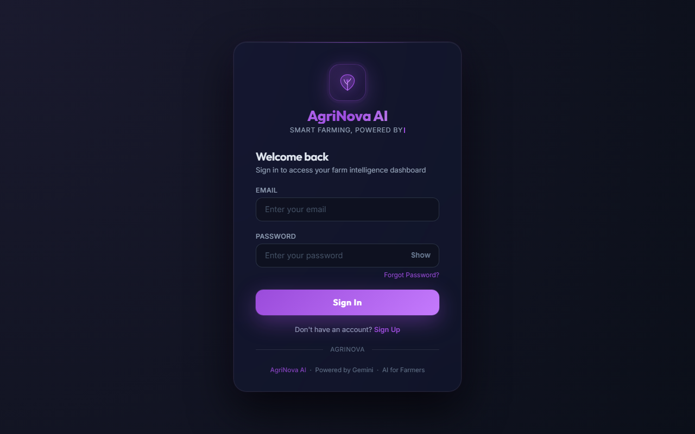
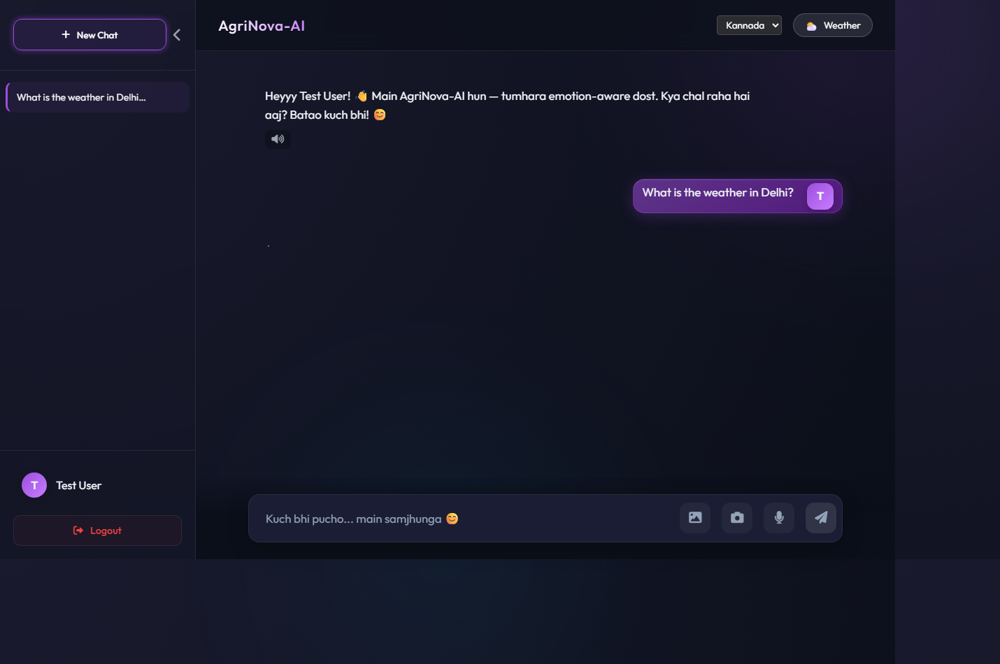
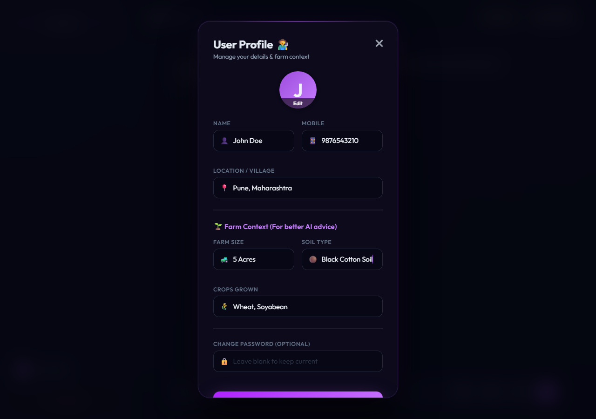
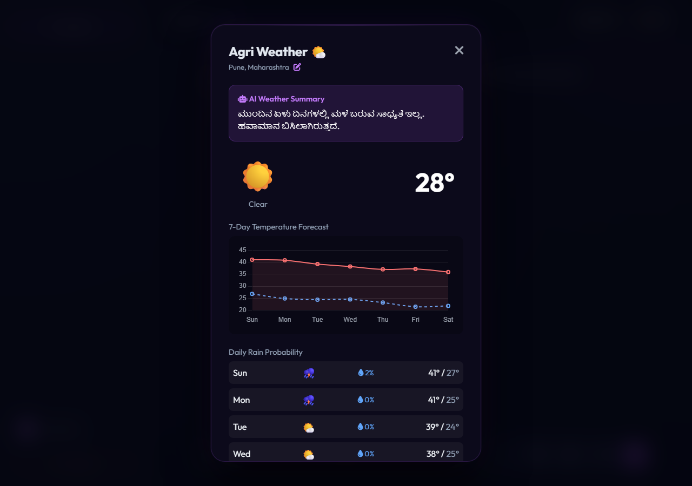

# 🌱 AgriNova AI — Intelligent Agricultural Assistant

<p align="center">
  
  
  
  
  
</p>

# 🌱 AgriNova AI — Smart Farming Assistant for Indian Farmers

AgriNova AI is a production-ready, full-stack AI assistant that helps farmers make better decisions using real-time weather data, mandi prices, and AI-powered crop disease detection.

Built with Google Gemini 2.5-Flash, it supports multilingual voice interaction and image-based diagnosis — making advanced agricultural intelligence accessible to rural India.

📦 GitHub: https://github.com/sunilnaik4582-jpg/AgriNova-AI)
---

## 📸 Screenshots

<table>
  <tr>
    <td align="center" width="50%">
      
      <br/>
      <b>🔐 Login Page</b>
      <br/>
      <sub>Glassmorphism dark-themed secure login with typewriter animation</sub>
    </td>
    <td align="center" width="50%">
      
      <br/>
      <b>💬 Chat Interface</b>
      <br/>
      <sub>Multilingual AI chat with crop disease diagnosis via image upload</sub>
    </td>
  </tr>
  <tr>
    <td align="center" width="50%">
      
      <br/>
      <b>🧑‍🌾 User Profile</b>
      <br/>
      <sub>Manage farm context for highly personalized AI advice</sub>
    </td>
    <td align="center" width="50%">
      
      <br/>
      <b>🌤️ Live Weather Dashboard</b>
      <br/>
      <sub>7-day forecast with AI-generated multilingual weather summaries</sub>
    </td>
  </tr>
</table>

> 📌 **Live Demo Features Shown:** Kannada language support, image-based crop disease diagnosis (Late Blight detection), emotion-aware responses, and sidebar chat history.

---

## ✨ Features

### 🤖 AI & Agentic Intelligence
- **Gemini 2.5-Flash** — Latest Google LLM with multi-turn conversation memory
- **Agentic Function Calling** — AI autonomously calls tools to fetch live data
- **RAG (Retrieval-Augmented Generation)** — ChromaDB-powered local knowledge base using agriculture PDFs
- **Multimodal Input** — Upload crop photos for visual disease diagnosis
- **Emotion-Aware Responses** — Detects sad, angry, happy, stressed, confused states and responds empathetically

### 🛠️ Real-Time Tools (Agent Actions)
| Tool | Description |
|------|-------------|
| `get_weather` | Live weather data via Open-Meteo API (temperature, humidity, wind, rain %, feels-like) — supports even small Indian villages |
| `get_mandi_price` | Crop market prices (Gehu, Chawal, Soyabean, Pyaj, Sarso, etc.) |
| `search_kisan_database` | Searches local ChromaDB vector store for expert agricultural answers |

### 🗣️ Voice & Language
- **Voice Input** — Web Speech API (speech-to-text)
- **Text-to-Speech (TTS)** — Reads bot replies aloud with emotion-based pitch/rate adjustment
- **Multi-language** — Kannada, Hindi, English (switchable in UI)

### 🔐 Authentication System
- **Secure Registration & Login** using email + hashed passwords (Werkzeug)
- SQLite `users.db` stores: Name, Location, Mobile, Email, Password Hash, Registration Date
- Session-based auth with 2-hour expiry
- Forgot Password UI (on login page)
- Glassmorphism login/register page with typewriter animation

### 💬 Chat Interface
- Sidebar with **Chat History** (localStorage, up to 20 sessions)
- **Rename** and **Delete** chat sessions
- **Inline Edit** user messages + re-send
- **Copy** button on user messages
- **Per-message TTS Play/Stop** button on bot replies
- Typing indicator (animated dots)
- Image attachment preview before sending
- Responsive design (mobile-friendly sidebar toggle)

---

## 🏗️ Project Structure

```
chatbot-project/
│
├── app.py                   # Main Flask backend (API, Auth, Gemini, Function Calling)
├── build_db.py              # Script to build ChromaDB vector knowledge base from PDFs/TXT
├── view_users.py            # Utility to view registered users from SQLite DB
├── requirements.txt         # Python dependencies
│
├── frontend/
│   ├── index.html           # Main chat UI (sidebar, chat area, voice, image upload)
│   ├── login.html           # Standalone login/register page (glassmorphism design)
│   └── style.css            # Full CSS (dark theme, glassmorphism, animations)
│   └── login/
│       ├── app.py           # Older standalone login Flask app (legacy/demo)
│       ├── templates/       # Jinja2 templates for login app
│       └── uploads/         # User file uploads (for login app)
│
├── data/
│   ├── kisan_schemes.txt    # Sample knowledge base: PM-KISAN, crop diseases
│   ├── NFSM12102018.pdf     # Agriculture scheme PDF (for RAG)
│   └── download.pdf         # Additional agriculture document (for RAG)
│
├── chroma_db/               # Auto-generated ChromaDB vector store (gitignored)
├── users.db                 # SQLite user database (gitignored)
│
├── test_agent.py            # Test script for Gemini agent/function calling
├── test_api.py              # Test script for Flask API endpoints
├── test_weather.py          # Test script for weather API integration
│
├── .env                     # API keys (gitignored — create manually)
├── .env.example             # Template for .env file
├── .gitignore               # Ignores .env, db files, logs, chroma_db, PDFs
└── README.md                # This file
```

---

## 🧠 Architecture

```
                        ┌─────────────────────────────────┐
                        │         User (Browser)           │
                        │  Text / Voice / Image Input      │
                        └──────────────┬──────────────────┘
                                       │ HTTPS
                        ┌──────────────▼──────────────────┐
                        │         Flask Backend            │
                        │         (app.py @ :5000)         │
                        │                                  │
                        │  ┌─────────────────────────┐    │
                        │  │   Auth (SQLite + Session)│    │
                        │  └─────────────────────────┘    │
                        │                                  │
                        │  ┌─────────────────────────┐    │
                        │  │  Gemini 2.5-Flash (LLM) │    │
                        │  │  + Function Calling      │    │
                        │  └────────────┬────────────┘    │
                        │               │                  │
                        │   ┌───────────┼───────────┐     │
                        │   ▼           ▼           ▼     │
                        │ Weather    Mandi       ChromaDB  │
                        │  API       Price         RAG     │
                        │(Open-Meteo)(Local)  (PDF/TXT KB) │
                        └──────────────────────────────────┘
```

---

## ⚡ Quick Start

### 1. Clone the Repository
```bash
git clone https://github.com/sunilnaik4582-jpg/AgriNova-AI.git
cd AgriNova-AI
```

### 2. Create Virtual Environment (Recommended)
```bash
python -m venv venv
venv\Scripts\activate      # Windows
# source venv/bin/activate # Linux/macOS
```

### 3. Install Dependencies
```bash
pip install -r requirements.txt
```

### 4. Set Up API Key
```bash
copy .env.example .env
```
Then open `.env` and add your Gemini API key:
```
GEMINI_API_KEY=your_google_gemini_api_key_here
```
> Get your free key at: https://aistudio.google.com/app/apikey

### 5. Add Knowledge Base (Optional — for RAG)
Place agriculture PDFs or `.txt` files inside the `data/` folder, then run:
```bash
python build_db.py
```
This will chunk the documents and build a ChromaDB vector store at `./chroma_db/`.

### 6. Run the Application
```bash
python app.py
```
Open your browser and go to: **http://127.0.0.1:5000**

---

## 🔑 API Endpoints

| Method | Endpoint | Description |
|--------|----------|-------------|
| `GET` | `/` | Serves main chat UI |
| `GET` | `/login.html` | Serves login/register page |
| `GET` | `/check_auth` | Check if user is logged in |
| `POST` | `/login` | User login (email + password) |
| `POST` | `/api/register` | New user registration |
| `POST` | `/logout` | Logout and clear session |
| `POST` | `/api/chat` | Send message to AI (supports image) |
| `POST` | `/api/clear_chat` | Clear current chat history |

---

## 🌐 Language Support

| Language | Voice Input | TTS Output | UI |
|----------|-------------|------------|----|
| Kannada (ಕನ್ನಡ) | ✅ | ✅ (kn-IN) | ✅ |
| Hindi (हिंदी) | ✅ | ✅ (hi-IN) | ✅ |
| English | ✅ | ✅ (en-IN) | ✅ |

---

## 🖼️ Image-Based Crop Diagnosis

Farmers can click the 📷 icon to attach a crop leaf photo. The AI (Gemini Vision) will:
1. Identify the crop and visible disease
2. Provide step-by-step treatment recommendations
3. Suggest exact pesticide names and dosages

---

## 🛡️ Security

- Passwords are hashed using **Werkzeug's** `generate_password_hash` (PBKDF2-SHA256)
- `.env` file is **gitignored** — API key never pushed to GitHub
- Session cookies: `HttpOnly`, `SameSite=Lax`, 2-hour expiry
- User database (`.db`) is gitignored

---

## 📦 Dependencies

```
flask==3.0.3
google-genai==0.6.0
python-dotenv==1.0.1
requests==2.32.3
chromadb==0.6.0
PyPDF2==3.0.1
```
> Note: `flask-cors` and `werkzeug` are installed automatically as Flask dependencies.

---

## 🧪 Testing Scripts

| Script | Purpose |
|--------|---------|
| `test_agent.py` | Tests Gemini agentic function calling end-to-end |
| `test_api.py` | Tests Flask API (login, chat, auth endpoints) |
| `test_weather.py` | Tests the weather tool with various Indian locations |
| `view_users.py` | Prints all registered users from SQLite DB |

---

## 🚀 Future Improvements

- [ ] Integration with official government Mandi API (Agmarknet / eNAM)
- [ ] Personalized farmer memory (remember past crops, location)
- [ ] Offline mode / PWA support for rural areas with poor connectivity
- [ ] More Indian languages (Tamil, Telugu, Marathi, Gujarati)
- [ ] Smarter emotion detection using NLP (beyond keyword matching)
- [ ] Push notification for weather alerts
- [ ] Crop calendar and planting schedule recommendations
- [ ] Admin dashboard for user management

---

## 💡 Why AgriNova AI?

India has over **140 million farming households**. Most do not have access to quick, reliable agricultural advice in their local language. AgriNova AI bridges that gap by combining:
- 🧠 State-of-the-art LLM (Gemini 2.5-Flash)
- 📚 Local expert knowledge (RAG from PDFs)
- 🌦️ Real-time data (weather + mandi prices)
- 🗣️ Voice in local languages
- ❤️ Empathy-driven conversation design

---

## 🤝 Contribution

Contributions are welcome! Feel free to:
1. Fork the repository
2. Create a feature branch (`git checkout -b feature/my-feature`)
3. Commit your changes
4. Open a Pull Request

---

## 📄 License

This project is open-source under the [MIT License](LICENSE).

---

<p align="center">
  Built with ❤️ for Indian Farmers &nbsp;|&nbsp; Powered by Google Gemini &nbsp;|&nbsp; AgriNova AI
</p>
